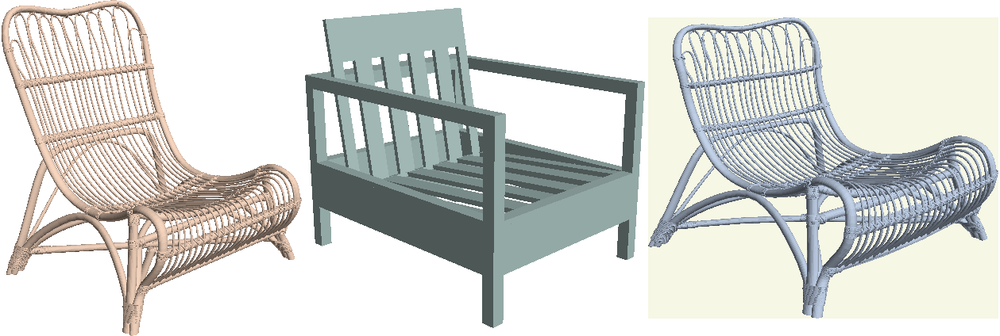

# Neural Cages for Detail-Preserving 3D Deformations
[[project page][project-page]][[pdf][arxiv-pdf]][[supplemental][supp-pdf]]
## Installation
```bash
git clone --recursive https://github.com/yifita/deep_cage.git
# install dependency
conda env create --name pytorch-all --file environment.yml
cd pytorch_points
python setup.py develop
# install pymesh2
# if this step fails, try to install pymesh from source as instructed here
# https://pymesh.readthedocs.io/en/latest/installation.html
# make sure that the cmake 3.15+ is used
pip install pymesh/pymesh2-0.2.1-cp37-cp37m-linux_x86_64.whl
# install other dependecies
pip install -r requirements.txt
```
### Optional
install Thea https://github.com/sidch/Thea to batch render outputs

## Demo
- deform source shape to target shape
```bash
# results will be saved in trained_models/chair_ablation_full/test
python cage_deformer_3d.py --dataset SHAPENET --full_net --bottleneck_size 256 --n_fold 2 --ckpt trained_models/chair_ablation_full/net_final.pth --target_model data/shapenet_target/**/*.obj  --source_model data/elaborated_chairs/throne_no_base.obj data/elaborated_chairs/Chaise_longue_noir_House_Doctor.ply --subdir fancy_chairs --phase test --is_poly
```
Example: input - target - output

- deformation transfer
```bash
# download surreal data from 3DCoded
cd data && mkdir Surreal && cd Surreal
wget https://raw.githubusercontent.com/ThibaultGROUEIX/3D-CODED/master/data/download_dataset.sh
chmod a+'x' download_dataset.sh
./download_dataset.sh

# baseline deform the original training source
python deformer_3d.py --dataset SURREAL --loss MSE --nepochs 2 --data_dir data/Surreal --batch_size 2 --num_point 6890 --bottleneck_size 1024 --template data/cage_tpose.ply --source_model data/surreal_template_tpose.ply  --ckpt trained_models/tpose_atlas_b1024/net_final.pth --phase test

# deformation transfer to a skeleton
python optimize_cage.py --dataset SURREAL --loss MSE --nepochs 3000 --data_dir data/Surreal --num_point 6890 --bottleneck_size 1024 --clap_weight 0.05 --template data/cage_tpose.ply --model data/fancy_humanoid/Skeleton/skeleton_tpose.obj --subdir skeleton --source_model data/surreal_template_tpose.ply --ckpt trained_model/tpose_atlas_b1024/net_final.pth --lr 0.005 --is_poly

# deformation transfer to a robot
python optimize_cage.py --ckpt trained_models/rpose_mlp/net_final.pth --nepochs 8000 --mlp --num_point 6890 --phase test --dataset SURREAL --data_dir /home/mnt/points/data/Surreal --model data/fancy_humanoid/robot.obj --subdir robot --source_model data/surreal_template.ply --clap_weight 0.1 --lr 0.0005 --template data/surreal_template_v77.ply
```

[project-page]: https://yifita.github.io/publication/deep_cage/
[arxiv-pdf]: https://arxiv.org/pdf/1912.06395.pdf
[supp-pdf]: https://yifita.github.io/publication/deep_cage/supplemental.pdf

## cite
```
@misc{yifan2019neural,
    title={Neural Cages for Detail-Preserving 3D Deformations},
    author={Wang Yifan and Noam Aigerman and Vladimir Kim and Siddhartha Chaudhuri and Olga Sorkine-Hornung},
    year={2019},
    eprint={1912.06395},
    archivePrefix={arXiv},
    primaryClass={cs.GR}
}
```